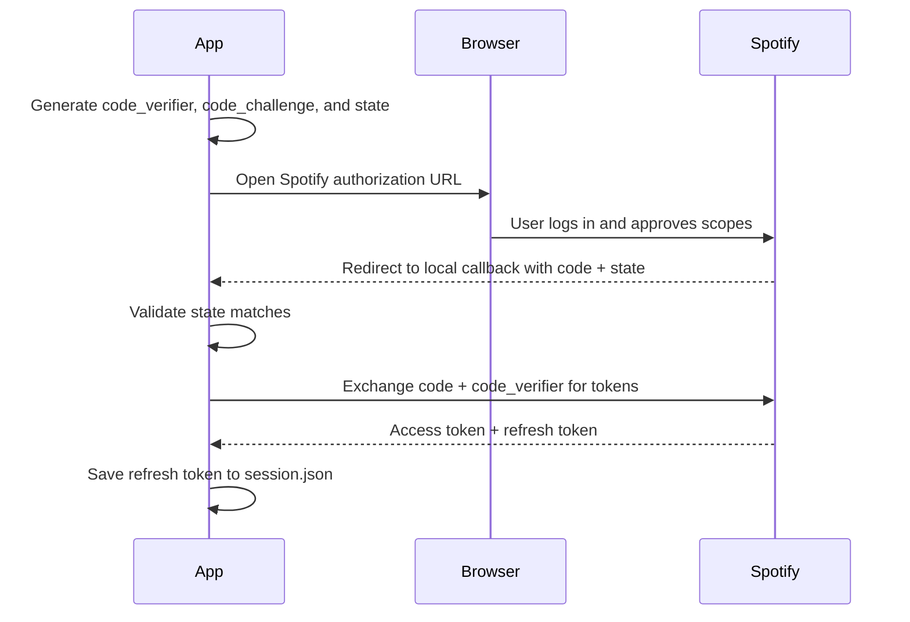
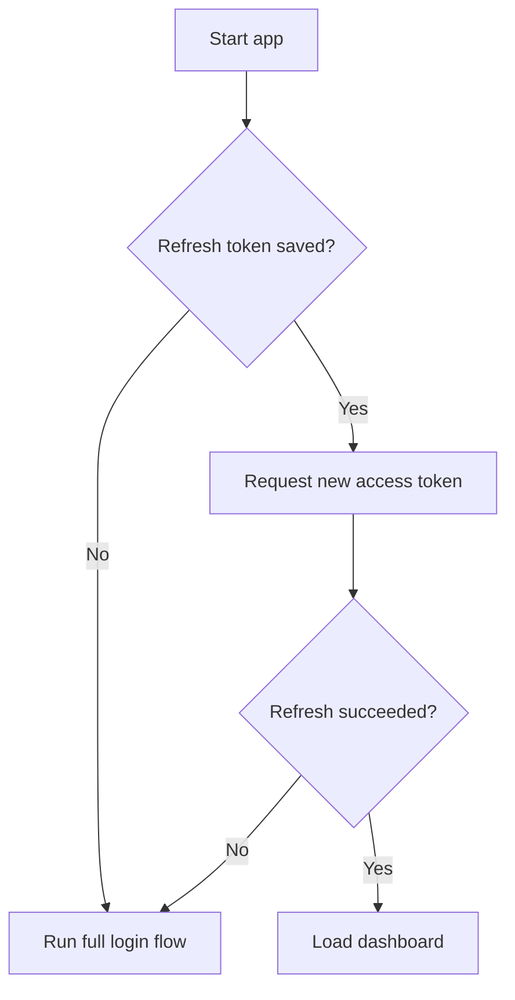

# Spotify Dashboard

A Python command-line application that authenticates with the Spotify Web API and displays a user's personal listening data — top artists, top tracks, and recently played songs.

Built to learn how OAuth 2.0 and REST APIs work in practice, from the authorization handshake through to persisting a session between runs.

## Overview

Spotify Dashboard walks through the full **Authorization Code with PKCE** flow: it spins up a local callback server, exchanges an authorization code for tokens, and stores a refresh token so you don't have to log in every time. From there, it's a simple interactive menu backed by three Spotify endpoints.

## Features

- Spotify OAuth 2.0 authorization with PKCE (no client secret required)
- `state` parameter validation to guard against CSRF
- Local HTTP server to handle the OAuth redirect (`/callback`)
- Persistent sessions via a locally stored refresh token
- Top artists and top tracks, filterable by short-, medium-, or long-term listening history
- Recently played tracks
- Logout, which clears the saved session

## Tech Stack

| | |
|---|---|
| Language | Python 3 |
| API | Spotify Web API |
| Auth | OAuth 2.0 (Authorization Code + PKCE) |
| Libraries | `requests`, `python-dotenv` |
| Standard library | `http.server`, `hashlib`, `secrets`, `base64`, `urllib.parse`, `webbrowser`, `json` |

## Prerequisites

- Python 3.10+
- A Spotify account
- A registered app in the [Spotify Developer Dashboard](https://developer.spotify.com/dashboard)

## Setup

**1. Clone the repository**

```bash
git clone https://github.com/NavaneethNem/Spotify_Dashboard.git
cd Spotify_Dashboard
```

**2. Install dependencies**

```bash
pip install -r requirements.txt
```

**3. Register a Spotify app**

In the Spotify Developer Dashboard, create an app and note its Client ID. Add the following redirect URI to the app settings:

```
http://127.0.0.1:8888/callback
```

**4. Configure environment variables**

Create a `.env` file in the project root:

```env
SPOTIFY_CLIENT_ID=your_client_id
SPOTIFY_REDIRECT_URI=http://127.0.0.1:8888/callback
```

`.env` and `session.json` are already covered by `.gitignore` — neither should be committed.

**5. Run it**

```bash
python main.py
```

The first run opens Spotify in your browser to authorize the app. Every run after that reuses the saved refresh token, unless you've logged out.

## Usage

Once authenticated, you'll land on a menu:

```
1. Find your top artists
2. Find your top tracks
3. Get your recently played tracks
4. Logout of the app and exit
5. Exit the app
```

Top artists and top tracks prompt for how many results to show, then a time range:

```
1. Short Term
2. Medium Term
3. Long Term
```

## How Authentication Works

**First login**



**Subsequent launches**



Logging out (option 4) deletes the saved refresh token, so the next launch requires a fresh login.

## Project Structure

```
Spotify_Dashboard/
├── main.py              # App entry point, auth flow, and menu
├── requirements.txt
├── .gitignore
├── .env                 # Local config — not committed
└── session.json         # Local session — not committed
```

## What I Learned

This project was a hands-on way to get comfortable with APIs and authentication:

- Making GET/POST requests and handling JSON responses with `requests`
- OAuth 2.0 concepts: authorization codes, access vs. refresh tokens, scopes
- PKCE (code verifier / code challenge) and why it removes the need for a client secret
- Validating the `state` parameter to prevent CSRF
- Running a minimal local HTTP server to catch an OAuth redirect
- Persisting session data to disk with JSON
- Structuring an interactive CLI application

## Possible Improvements

- Refresh the access token automatically mid-session instead of only on startup
- Cover more Spotify endpoints (playlists, saved tracks, audio features)
- Add input validation and clearer error messages
- Add a GUI or web front end
- Visualize listening stats (charts, genre breakdowns)

## License

No formal license yet — this is a personal learning project, feel free to reference it for your own.
